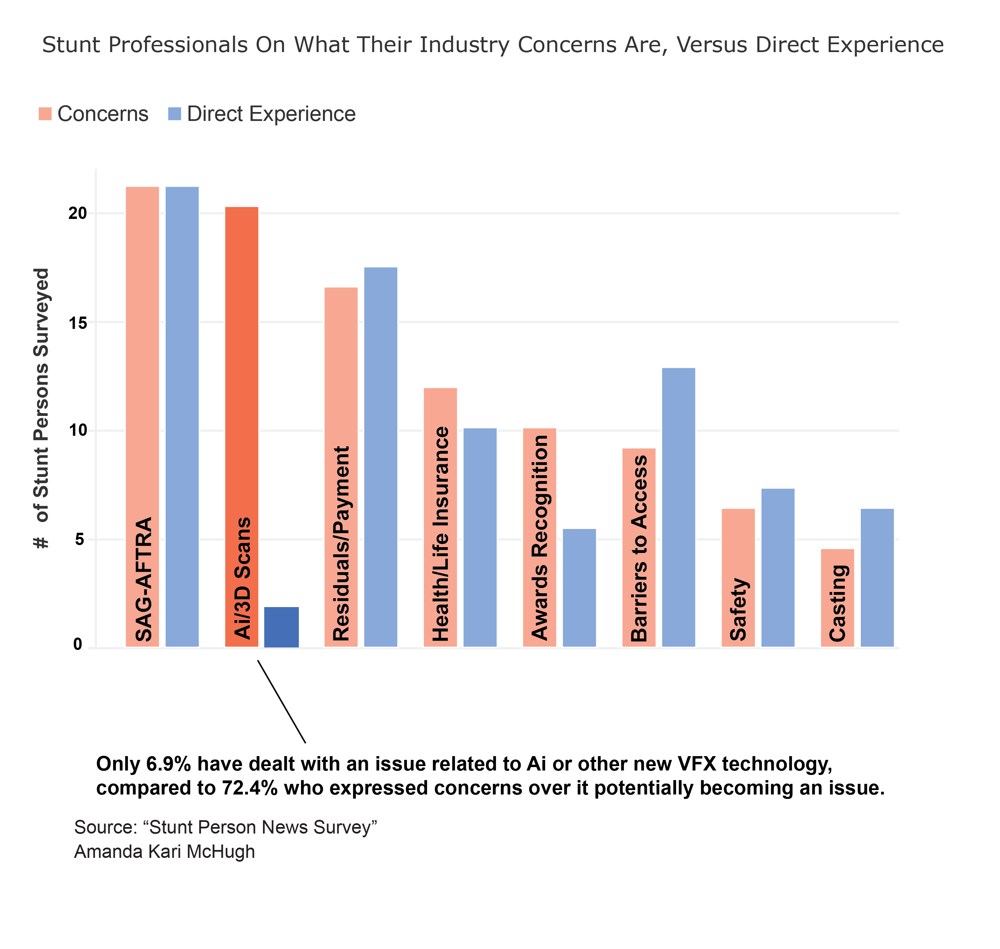
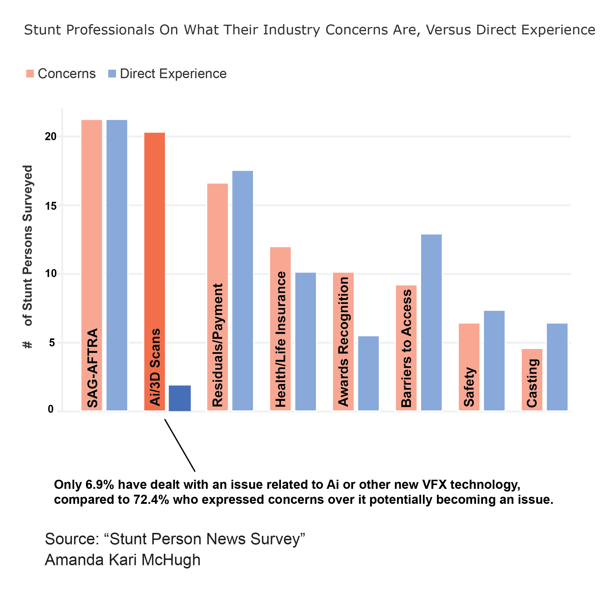
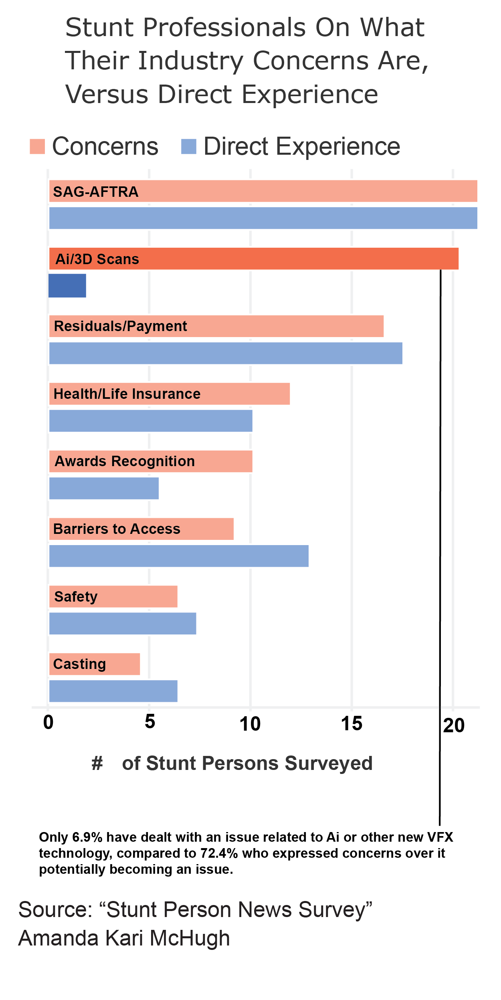

<!DOCTYPE html>
<html lang="en" dir="ltr">
<head>
    <meta charset="utf-8">
    <title>In Stunts the Concerns Over Ai Just Don’t Line Up</title>
    <link rel="stylesheet" href="style-sheet.css">
</head>
<body>
    

        <h1>
In Stunts the Concerns Over Ai Just Don’t Line Up
</h1>
        <h3>
<i>Ai and 3D scan technology is a top concern amongst stunt professionals, but few have met with any challenges because of it.</i>
</h3>
        
By: Amanda Kary McHugh

      
Artificial intelligence has become a top concern for many in the last year. This makes sense, given that the <a href="https://www.weforum.org/reports/the-future-of-jobs-report-2023/digest/>World Economic Forum"</a> has estimated that approximately 87 million jobs could be automated by 2027. It was a top concern amongst writers during the WGA strikes last year, given that ChatGPT has already shown to be able to produce entire scripts and other writing jobs, such as copywriting, have <a href="https://www.washingtonpost.com/technology/2023/06/02/ai-taking-jobs/">already taken a hit</a>.

SAG-AFTRA members – which includes actors, stunt professionals and voiceover artists – have also had their concerns with Ai potentially taking their jobs. With deepfakes such as the life-life <a href="https://www.cnn.com/2021/08/06/tech/tom-cruise-deepfake-tiktok-company/index.html">Tom Cruise TikTok video</a> getting a new lease on the internet during the strikes, the concern with what visual effects can do with Ai, has had members concerned about 3D scan technology.

“It's already hard enough to sort of make a living as an actor without Ai protection and without reasonable compensation for the streaming revenues. That just looks less and less possible going forward,” said John Croft, an actor who was on a SAG-AFTRA picket line last September.

This tech has been around for a while, and isn’t the same as Ai. What it does is take static 3D images of someone, which can then be used to generate digital versions of that actor or stunt professional, which can help when needing to do things such as make a stunt look more life-like or create a crowd scene by generating multiple copies of a background actor, or create a completely digital stunt that is maybe not possible for that stunt professional to safely perform.

Given the potential for this technology to digital copies of people without them knowing and therefore not getting paid for it’s use, it makes sense that negotiating pay for 3D scans and how they are used, was <a "href=https://variety.com/2023/biz/news/sag-aftra-background-actors-artificial-intelligence-1235673432/">a key concern for the SAG-AFTRA contract</a>. However, a recent survey  shows a vast disparity between the number of stunt professionals with whom this technology is a top concern for them, versus those who have actually dealt with issues related to it.

            <!-- Image for desktop -->
            
            <!-- Image for tablet -->
            
            <!-- Image for mobile -->
            
        

The survey showed that of the 29 surveyed, which included stunt professionals based in New York City, Atlanta and Los Angeles, only two people have dealt with an issue related to this tech, versus the 22 that said it was a top concern for them. However, it’s important to note, that the majority of those surveyed were based in NYC; and according to stunt veteran Aaron Vexler, NYC is a TV town and most projects that would be using this kind of technology are based in Atlanta, as that is where most Marvel projects are filmed. On three separate occasions, he had scenes that he performed stunts in used on episodes of shows that he did not get notified for or paid for. And this is without needing Ai to do the damage. Had he and his stuntwoman wife not been an avid watcher of these shows already, they wouldn’t have caught them.

“I'm sure there's been things that we haven't caught. I mean, my wife and I both have been doing this 20 years now. We both work between 50 and a hundred days a year on at least 10 or 20 different projects a year. So the chance of it, plus, probably not catching something, is extremely high,” Vexler said.

While Vexler was able to file claims with SAG-AFTRA to get paid for the scenes he did catch, the ratified contract doesn’t include any explicit language to protect stunt professionals against 3D scans of actors being used to replace them. This is one reason why the top concern that this survey shows is the lack of support from SAG-AFTRA, but with direct experience to back up the validity of those concerns. So, the survey is reflective of one key issue that kept coming up during the contract negotiations: with this lack of support, what does the future hold for stunts, when the gap between concerns for Ai and experiences with issues related to Ai begins to close too?

    

  </body>
</html>
